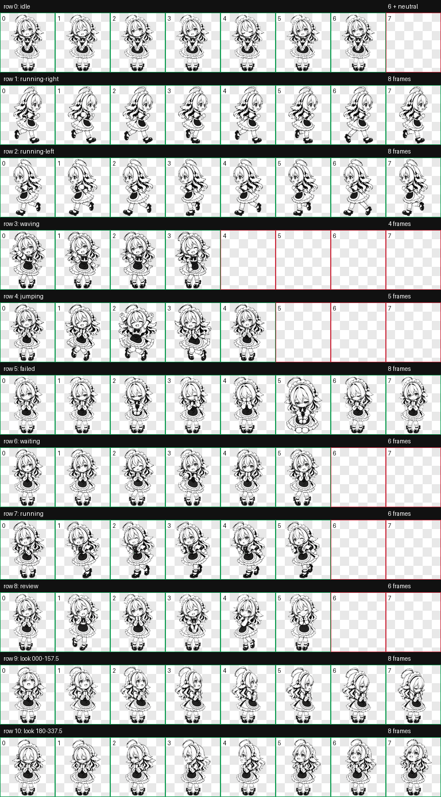
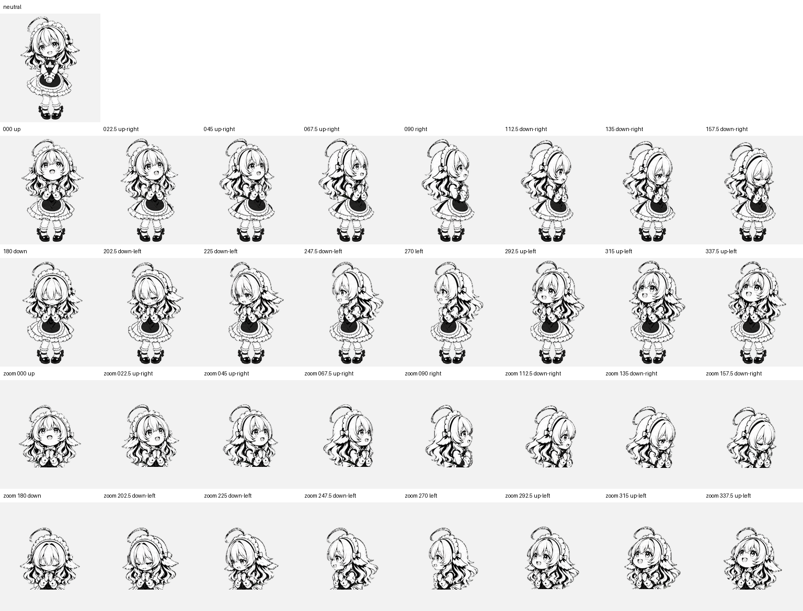

# 墨羽天使女仆 · Moyu Angel Maid

[](pet.json)
[](LICENSE)

一个面向 Codex Pet v2 的黑白墨线天使女仆动态宠物。

她保留了白色波浪长发、褶边女仆头饰、蝴蝶结与小翅膀，动作表达安静待机、左右移动、挥手、跳跃、失败、等待帮助、处理任务、审查，以及 16 个连续视线方向。整体气质对应一位认真、温柔、可靠的代码与发布流程值班助手。

## 预览

标准动作与 16 个视线方向都收录在 v2 图集中。下面的预览图用于快速检查动作、轮廓和方向连续性。





## 文件

- `pet.json`：Codex Pet v2 元数据
- `spritesheet.webp`：`1536×2288` 的 8×11 v2 精灵图，基于 `192×208` 单元格
- `assets/contact-sheet-extended.png`：完整图集预览
- `assets/look-directions.png`：中性姿态与 16 个方向预览
- `source/moyu-angel-maid-master.svg`：可放大、可再编辑的矢量母版
- `CHANGELOG.md`：版本记录

## 安装

将仓库目录复制到 Codex 宠物目录：

```sh
mkdir -p ~/.codex/pets/moyu-angel-maid
cp pet.json spritesheet.webp ~/.codex/pets/moyu-angel-maid/
```

目录中需要同时保留 `pet.json` 与 `spritesheet.webp`。重新启动或刷新 Codex 后即可使用。

## 矢量母版

`source/moyu-angel-maid-master.svg` 是从最终清晰版图集追踪得到的真实 SVG 路径母版，包含白色轮廓层和黑色墨线层，不嵌入原始位图。它用于放大检查、再编辑和未来导出；当前 Codex 运行时仍加载根目录的 `spritesheet.webp`。详见 [`source/README.md`](source/README.md)。

## 资源约束

- `spriteVersionNumber` 必须保持为 `2`。
- 精灵图必须保持 `1536×2288`，每个单元格为 `192×208`。
- 透明背景、动作行顺序和 16 个视线方向需要保持 Codex Pet v2 合约。
- 贡献视觉改动时，请同时更新 `assets/` 下的预览图。

## 验证状态

当前发布版本已通过：

- v2 atlas 尺寸与单元格结构验证；
- 透明背景与边缘色键清理验证；
- 9 个标准动作行验证；
- 4 个 cardinal anchor 与 16 个视线方向验证。

## 许可与来源

MIT License，见 [LICENSE](LICENSE)。角色视觉由 OpenAI 图像生成工具根据用户提供的参考图生成；仓库不包含原始参考图。

欢迎通过 Issue 或 Pull Request 提交文档修正和资源改进建议，详见 [CONTRIBUTING.md](CONTRIBUTING.md)。
